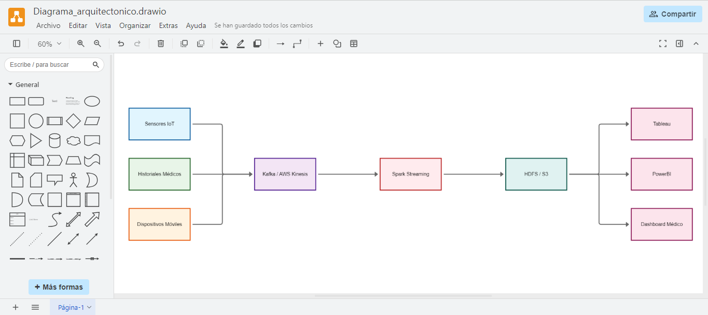

1. **Documento comparativo de arquitecturas Big Data**

*Introducción*

- Propósito: Comparar arquitecturas Big Data para seleccionar la más adecuada en distintos escenarios.

- Alcance: Hadoop, Spark y soluciones en la nube (AWS, GCP o Azure).

*Glosario:*

- HDFS: Hadoop Distributed File System

- YARN: Yet Another Resource Negotiator

- RDD: Resilient Distributed Dataset

- ETL: Extract, Transform, Load

*Descripción de arquitecturas*

- Hadoop: procesamiento batch con MapReduce, almacenamiento en HDFS, escalabilidad horizontal manual, requiere configuración compleja.

- Spark: procesamiento en memoria, soporta batch y streaming, APIs en Python/Scala, librerías como SparkSQL y MLlib.

- Cloud (AWS/GCP/Azure): servicios gestionados, escalabilidad automática, paga-por-uso, ideal para analítica en tiempo real y menor complejidad de gestión.

2.**Tabla comparativa de características**

| Aspecto              | Hadoop (On-premise)        | Spark (Clúster)                 | Nube (AWS/GCP/Azure)                 |
| -------------------- | -------------------------- | ------------------------------- | ------------------------------------ |
| **Procesamiento**    | Batch (MapReduce)          | En memoria, batch + streaming   | Batch + streaming gestionado         |
| **Escalabilidad**    | Manual, nodos físicos      | Horizontal con cluster manager  | Automática según demanda             |
| **Facilidad de uso** | Complejo (instalación)     | APIs más amigables              | Interfaces simplificadas             |
| **Costos**           | Infraestructura propia     | Servidores dedicados            | Paga por uso                         |
| **Casos de uso**     | Procesamiento batch masivo | Machine Learning, análisis real | Analítica empresarial en tiempo real |

3. **Caso de uso aplicado en un sector real**

- Escenario elegido: Salud (Smart Health IoT)
Un hospital procesa:

- Hadoop: almacenamiento histórico de expedientes y grandes volúmenes de imágenes médicas.

- Spark: análisis predictivo sobre brotes epidemiológicos en tiempo real con datos de sensores y registros.

- Cloud (ej. AWS HealthLake, BigQuery): integración de historiales clínicos distribuidos, escalabilidad y dashboards en tiempo real para médicos.

4. **Diagrama arquitectónico**

- Fuente de datos: sensores IoT, historiales médicos, dispositivos móviles.

- Ingesta: Kafka / AWS Kinesis.

- Procesamiento: Spark Streaming.

- Almacenamiento: HDFS (Hadoop) o S3 (nube).

- Consumo: Tableau / PowerBI / Dashboard médico.

5. **Reflexión crítica y justificación**

- Hadoop: útil para batch histórico, pero poco flexible en tiempo real.

- Spark: balance entre batch y streaming, ideal para análisis avanzado.

- Nube: mejor opción para salud por escalabilidad, seguridad integrada, reducción de costos iniciales y cumplimiento normativo (HIPAA/GDPR).

**Conclusión:**

 Para un hospital o empresa retail como el escenario del taller, la arquitectura en la nube es la más adecuada por su flexibilidad, escalabilidad automática y modelo de pago por uso.